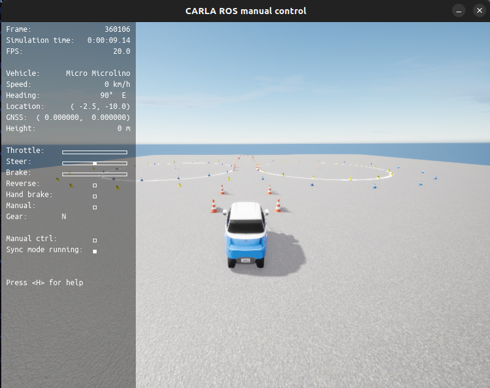
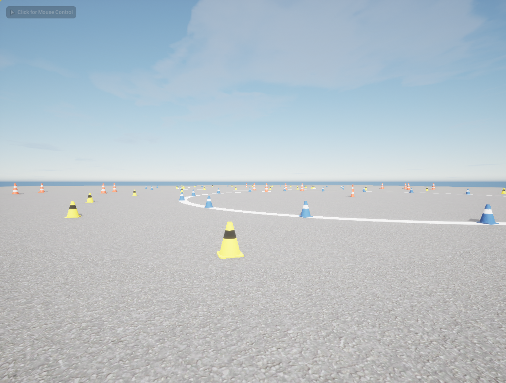
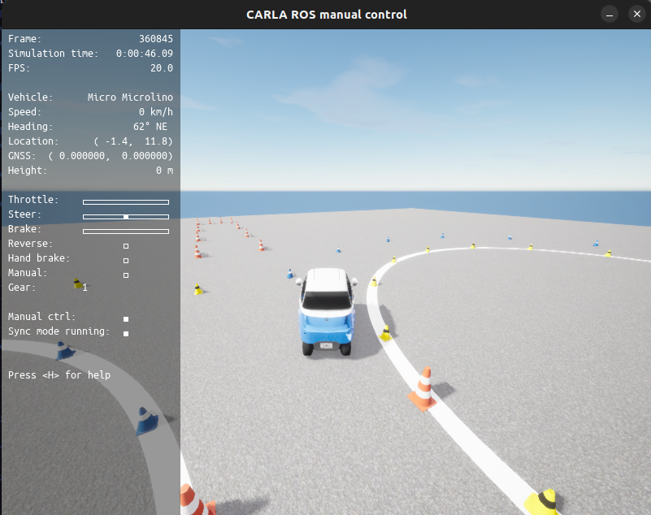

# CARLA ROS2 Driverless Simulation

ROS2-based simulation interface for autonomous vehicle development using the CARLA simulator.

This repository contains tools and datasets used to run driverless vehicle simulations in CARLA, focusing on sensor remapping, competition track representation and cone-based track environments used in Formula Student Driverless competitions.

The project enables integration between CARLA simulation outputs and ROS2-based autonomous vehicle software stacks.

---

# Overview

Autonomous racing environments such as Formula Student Driverless rely on cone-based tracks where the vehicle must detect and navigate through blue, yellow and orange cones.

This repository provides:

- ROS2 topic remapping for CARLA simulation
- cone coordinate datasets used for track generation
- example simulation environments used for testing
- integration between CARLA and ROS2 pipelines

The goal is to support development and testing of driverless algorithms in a realistic simulation environment.

---

# Repository Structure

carla-ros2-driverless-simulation

src/
  remap_simulation.py

data/
  skidpad.csv
  autocross__cones.csv

media/images/
  carla_skidpad_1.png
  carla_skidpad_2.png
  carla_skidpad_3.png

---

# Main Component

## remap_simulation.py

The core component of this repository is the ROS2 node:
remap_simulation.py

This node is responsible for adapting CARLA simulation topics to the format expected by the rest of the autonomous vehicle software stack.

It performs tasks such as:

- camera topic remapping
- depth camera remapping
- odometry message adaptation
- coordinate frame handling
- vehicle control command publishing

This allows the CARLA simulator to act as a drop-in environment for testing autonomous driving software developed with ROS2.

---

# Track Data

The repository includes cone coordinate datasets used to generate racing tracks in the simulation environment.

These datasets represent typical Formula Student Driverless track layouts.

## skidpad.csv

Contains cone coordinates for a skidpad-style track used in driverless testing scenarios.

Skidpad tracks are commonly used to evaluate vehicle stability and autonomous control behavior.

## autocross_cones.csv

Contains cone coordinates for an autocross-style track layout.

Autocross tracks are more complex and represent realistic racing environments where the vehicle must perform rapid navigation decisions.

---

# Cone Coordinate Representation

The cone coordinate datasets contain positions for different cone types used in driverless competitions.

Typical cone types include:

- blue cones (left boundary)
- yellow cones (right boundary)
- orange cones (start/finish gates)

These coordinates are used by the simulation environment to construct the racing track and validate perception and planning algorithms.

---

# CARLA Simulation Examples

The following images show examples of the simulation environment used for testing.

## Driverless Track Simulation

## Cone-Based Track Layout

## Simulation Environment

The vehicle navigates through a cone-defined racing environment similar to those used in autonomous racing competitions.

---

# Technologies Used

- Python
- ROS2
- CARLA Simulator
- Unreal Engine
- Autonomous Vehicle Simulation

---

# Use Case

This project was developed for experimentation and development of autonomous vehicle software in simulated racing environments.

The repository demonstrates how CARLA simulation data can be integrated into a ROS2-based robotics pipeline for driverless vehicle development and testing.

---

# Applications

Possible applications include:

- testing perception algorithms
- validating planning and control pipelines
- simulating Formula Student Driverless tracks
- developing autonomous vehicle software in simulation

---

# License

This project is released under the MIT License.
